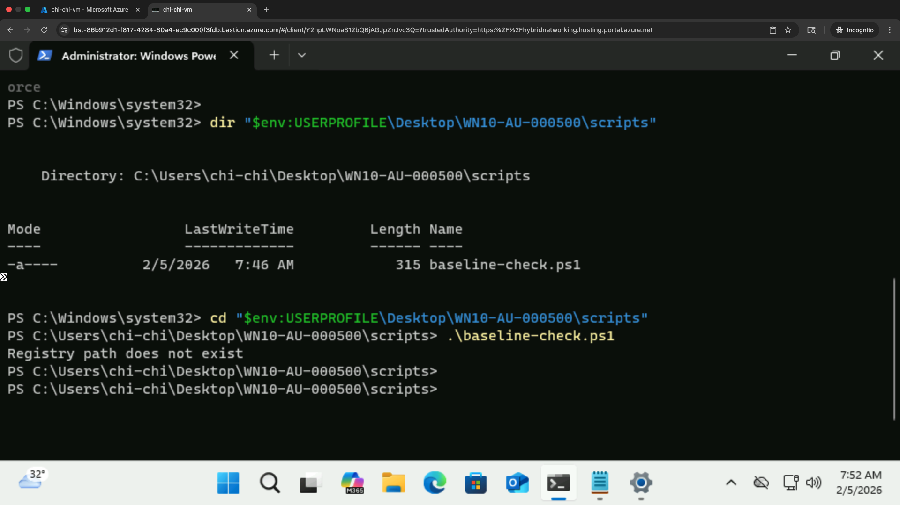
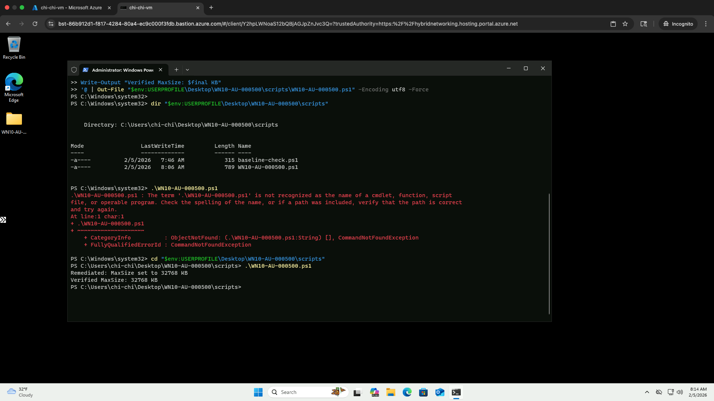
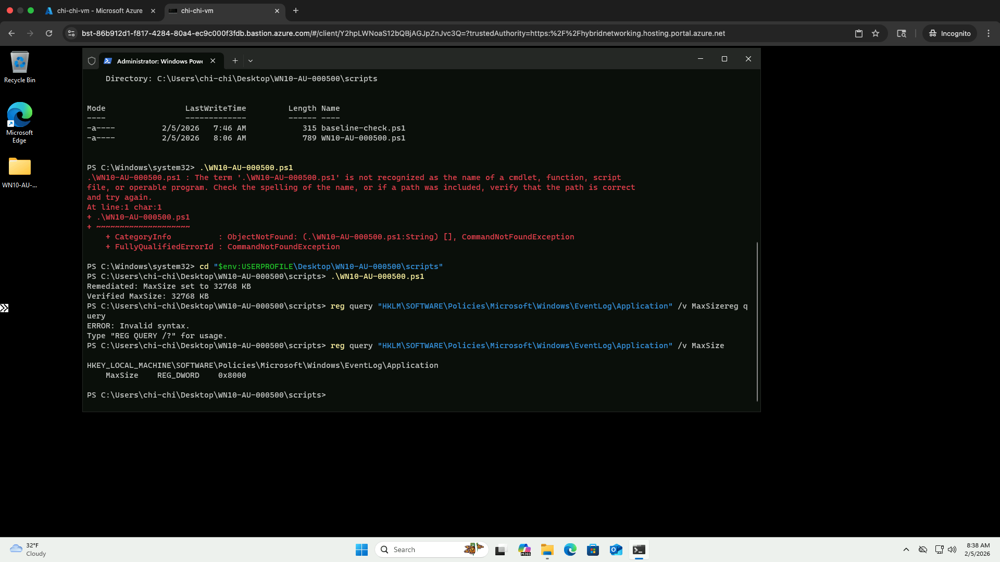

# 🛡️ Windows 10 STIG Remediation — WN10-AU-000500

## 📘 Project Overview
This project demonstrates validation, remediation, and verification of the Windows 10 STIG control **WN10-AU-000500**, which requires the **Application Event Log maximum size** to be configured to **32768 KB (32 MB) or greater** to ensure sufficient audit log retention.

The lab was performed on a Windows virtual machine accessed through **Azure Bastion** and executed using **administrative PowerShell**.

---

## 🎯 Objective
- Identify non-compliant audit logging configuration  
- Implement automated remediation using PowerShell  
- Validate the registry configuration independently  
- Produce audit-ready evidence of compliance  

---

## 🧰 Technologies Used
- Windows 10 Virtual Machine  
- PowerShell (Administrator)  
- Windows Registry (Policy configuration)  
- Azure VM / Bastion Access  
- GitHub (Documentation and Version Control)  

---

## 📜 STIG Requirement
Registry configuration must be:

HKEY_LOCAL_MACHINE\SOFTWARE\Policies\Microsoft\Windows\EventLog\Application
Value: MaxSize
Type: REG_DWORD
Minimum Value: 32768

---


This configuration ensures logs are not overwritten prematurely and preserves forensic visibility for investigations and incident response.

---

## 📂 Scripts
- Baseline compliance check  
  `scripts/baseline-check.ps1`

- Remediation script  
  `scripts/WN10-AU-000500.ps1`

---

## 📸 Evidence

### Baseline (Non-Compliant)


### Remediation Execution


### Validation (Compliant)


---

## 🔍 Validation Command
```powershell
reg query "HKLM\SOFTWARE\Policies\Microsoft\Windows\EventLog\Application" /v MaxSize
```

----

✅ Outcome

The system was initially non-compliant due to a missing policy registry configuration. After executing the remediation script, the required registry value was successfully created and independently verified, bringing the system into compliance with WN10-AU-000500.


